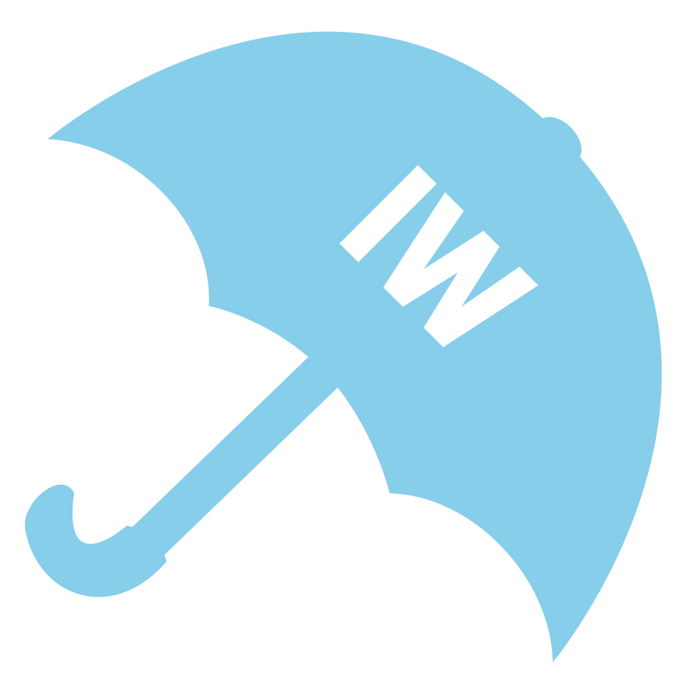

# </img>&nbsp;[Instant weather](https://tomleblais.github.io/TD2_Coolcoolcoolcool_IW/)
##### by [Coolcoolcoolcool](https://youtu.be/zDcbpFimUc8) team Tom LE BLAIS, Ethan LE NEINDRE, Clément SCHNEIDER, Alexandre LEROSIER

### _Introduction_
:information_source:&nbsp;[MétéoConcept](https://api.meteo-concept.com/) has made an API which returns the French meteo statistics, by city. Linked with the french API made by the government for the [administrative division](https://geo.api.gouv.fr/decoupage-administratif/communes), which returns the list of cities with a postal code among other, we take the postal code with a input button, and we send it to Météoconcept's API.

### _Features_
| Function | Description |
| -------- | ----------- |
| Input your postal code | Select the input HTML form to enter your postal code in the webpage. |
| Choose your city | You can choose your city if there is many city with the same postal code. |
| Choose the informations you want | You can select a lot of other informations, which are not displayed by default. |
| Choose how many days you want | Use the selector bar to choose how many days you want to display, from the current day (1 to 7 days). |
| Enter your choices | When you have finished your choices, you can press the `"Envoyer"` button, and the data will load from the APIs. |

### _Launch_
##### 2 ways :
1. :link:&nbsp;Click on the following link : https://tomleblais.github.io/TD2_Coolcoolcoolcool_IW/.
2. :file_folder:&nbsp;Download the project and extract it on your computer, on my GitHub repository : https://github.com/tomleblais/TD2_Coolcoolcoolcool_IW.

### _Credits_
- :busts_in_silhouette:&nbsp;Tom LE BLAIS `project manager`, Ethan LE NEINDRE, Clément SCHNEIDER, Alexandre LEROSIER
- :school:&nbsp;IUT Grand-Ouest Normandie
- :man_teacher:&nbsp;According to [`Christophe VALLOT`](https://github.com/princecorg)'s classes

### _Contact_
- :envelope:&nbsp;Mail : [`tom.leblais@etu.unicaen.fr`](mailto:tom.leblais@etu.unicaen.fr)
- :iphone:&nbsp;Discord : `tomelette_`
